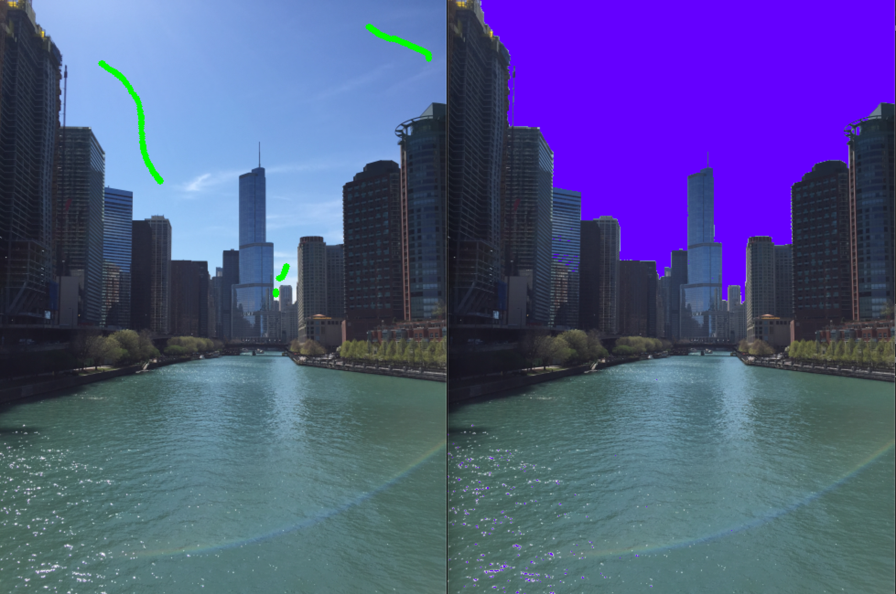
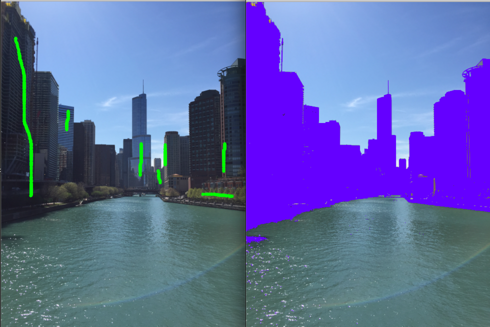

# Interactive Local Adjustment of Tonal Values

As described in [this paper](https://www.cs.huji.ac.il/~danix/itm/itm.pdf) by Lischinski, Farbman, Uyttendaele, Richard Szeliski. This code demonstrates using different brushes to select regions of an image.  

**Note:** Tone mapping is not working as of now.

## Example

  
Example of using Lumachrome brush to select the sky region.  
Luminance threshold: 30  
Chroma threshold: 10

  
Example of using Lumachrome brush to selecting regions excluding the sky and the water.  
Luminance threshold: 30  
Chroma threshold: 10

## Dependencies

* Python 3.7
* [OpenCV 3.4.2](https://docs.opencv.org/3.4.2/d1/dfb/intro.html) - For image manipulation
* [Numpy 1.16](https://www.numpy.org/) - For easy data array manipulation

### Installing

cd into cloned directory. Then:

* `virtualenv env`
* `source env/bin/activate`
* `python main.py` 

Note: Installing OpenCV takes a while.

## Limitations
This program currently supports using basic brush, luminance brush, or lumachrome brush to set constraints to a selected region.  

## Future work
I would like to make improvements to get the minimization function to work properly.  
I also would like to optimize the speed of the program by avoiding nested for loops.

## License

This project is licensed under the MIT License - see the [LICENSE.md](LICENSE.md) file for details
